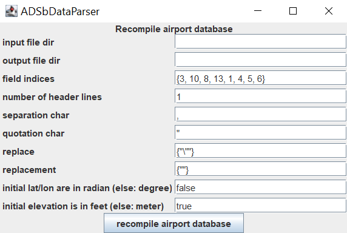

# *ADSb***DataParser**

The ADS-B data parser is based on the work of L.L. Schmidt and C. Bloemer-Zurborg conducted at the Institute of Flight Guidance, TU Braunschweig. It can be used to filter and preprocess ADS-B data and is especially adapted to historic traffic data with format *state_vectors_data4* of [The OpenSky Network](https://opensky-network.org/). 

Notices: 

* The data parser can do its best, when fed with the whole raw trajectory available. Even though if only parts of the trajectory are of interest. 
* If not deactivated: Redundant samples of the trajectory are filtered by the data parser (see redundancy-filtration). The returned parsed trajectory therefore needs to be interpolated to regain the aircraft state at any timestamp. 

Example: 

*Note: This version (2-23) of the ADSbDataParser supports log-files of the Trino interface with the CLI-Client, but log-files of the previous Impala interface with PuTTY are still supported. (June 2024)*

## Quick start guide (MATLAB required)

1. Download (and extract - if zipped) this repository. 
2. Start MATLAB and navigate to directory *'./MatlabInterface'* in the downloaded repository-folder
3. **This step is optional** (for completeness metric required): Download, recompile and set airport database

i. Download airport database from [OurAirports](https://ourairports.com/) here: https://ourairports.com/data/airports.csv and save the file to *'./MatblabInterface/airports.csv'* in the downloaded repository-folder

ii. Recompile airport database with following command in MATLAB: 

	javaADSbParserRecompileAirportDatabase("./airports.csv", "./airportDatabase.attapt");

iii. Set airport database directory *("./airportDatabase.attapt")* in files *javaADSbParser.m* and *javaADSbParserParallel.m* in variable *AIRPORT_DATABASE_FILE_DIR* (you may just use the presets in the comments - see lines 13 and 15 in the function files)

4. Gather ADS-B data from the Historical Database of [The OpenSky Network](https://opensky-network.org)

i. Connect to the Historical Data Interface of [The OpenSky Network](https://opensky-network.org) with the [Trino CLI](https://trino.io/docs/current/client/cli.html) and log the communication to the file *'./MatlabInterface/trinoFiles/flight_DLH9U.log'*. 

	java -jar trino-cli-*-executable.jar --user=USER --password --server=https://trino.opensky-network.org --external-authentication --catalog "minio" --schema "osky" > ./MatlabInterface/trinoFiles/flight_DLH9U.log

*Please note the hint to write the user name in all lower case letters ([A Quick Guide To OpenSky's Historical Data Interface](https://opensky-network.org/data/historical-flight-data))*

ii. Request flight *'DLH9U'* from the Historical Database via the Trino interface with the following command: 

	SELECT time, icao24, lat, lon, velocity, heading, vertrate, callsign, onground, alert, spi, squawk, baroaltitude, geoaltitude, lastposupdate, lastcontact, hour FROM state_vectors_data4 WHERE callsign='DLH9U   ' AND time>=1494235200 AND time<=1494246600 AND hour>=1494234000 AND hour<=1494248400;

iii. End connection (Trino - Historical Data Interface): 

	exit;

5. Parse the flight in Matlab with: 
<pre>
	parsedTrajectory = javaADSbParser("./trinoFiles/flight_DLH9U.log");
</pre>

6. Plot the parsed trajectory in Matlab (with interpolated aircraft states - max. time-step: 10 sec.): 
<pre>
	javaADSbParserPlot(parsedTrajectory, 10);
	javaADSbParserPlotCombined(parsedTrajectory, 10);
</pre>

## Redundancy-filtration, interpolation and reliability-channel

Initially the data parser is filtering redundant samples in horizontal and vertical plane. That is to say, samples which can be interpolated on an orthodrome (great circle) in the horizontal plane and with linear interpolation in the vertical plane (within certain margins) are removed from the parsed trajectory.  
Margins are set to:  
 -> horizontal plane: cross-track-distance: *+-0.01 NM*, along-track-distance: *+-0.1 NM* 
 -> vertical plane: *+-26 ft* 
 
In combination with the filtering of faulty data, this led to a reduction of the number of samples to 7.5 &#37; in a dataset comprising 5467 trajectories.  
 
When using the MATLAB-interface, the underlying raw-data (version used by the parser, not initial state-vectors-data4 trajectory) is stored in the return-struct (parsedTrajectory.raw). To utilize the aforementioned memory reduction of redundancy-filtration it is proposed to clear this field (parsedTrajectory.raw) from the result-struct, if it's not required anymore. Especially datasets with numerous parsed trajectories benefit from this memory reduction.  
 
To re-obtain the aircraft states, the position (horizontal plane) needs to be interpolated on an orthodrome (great circle) and the baro altitude (vertical plane) needs to be interpolated linearly. The margins of redundancy-filtration apply for these interpolated states. When using the MATLAB-interface, the interpolation can be done with following function-call: 
<pre>
interpolatedStates = javaADSbParserInterpolate(parsedTrajectory, timestamps);
</pre>
 
The filtering of redundant samples also removes information about the timestamps of underlying supporting samples. These samples passed the data-fault filtering and are considered to be valid samples to define the final trajectory. But some of them are probably removed during redundancy filtration.  
 
With this removal also information about the timestamps of received state updates via ADS-B are removed. Therefore the data parsers output contains a reliability-channel (in case of MATLAB-interface: [parsedTrajectory.reliabilityTime, parsedTrajectory.reliability]). This channel shall indicate the reliability of the final (re-interpolated) trajectory, ranges from 0 to 1 and has a time-step of 5 sec. For example: In trajectory segments without receiver coverage (no supporting samples) the reliability-channel shall take 0 as value. To assess the reliability of the (re-interpolated) trajectory, this channel is recommended to be used.  
 
In case of the MATLAB-interface the returned struct furthermore contains all used valid (fault-filtered, but not redundancy-filtered) sample-timestamps of horizontal and vertical plane (within parsedTrajectory.samplingTime). You may also clear this field for memory reduction, if it's not required anymore.  
 
 

The redundancy filtration, which is initially activated, can be turned off. For the MATLAB-interface please use the variable *FILTER_REDUNDANT_SAMPLES* in files *javaADSbParser.m* (line 16) and *javaADSbParserParallel.m* (line 22). To deactivate redundancy filtration in command line mode for the current execution you can use the command line argument '-r=OFF'. 

## Flight phase recognition

The data parser comprises functions which try to identify the flight phases of parsed trajectories.  
 
If the flight phase type is not specified directly by name, following indexing may be used: 
 
*(Please note: The enum in the source code has a different indexing.)*

	-1: undefined/ unknown
	 0: cruise
	 1: level
	 2: climb
	 3: descent

MATLAB plots of the data parser use the following color coding: 

## How to use

The data parser is developed using Java technology. You may use it directly from command line, by starting its GUI or by using the provided m-files of the MATLAB-interface. 

### Input data

Requests of historic flights of table *state_vectors_data4* from [The OpenSky Network](https://opensky-network.org) via the Trino interface serve as input to the data parser. That is to say the parser directly loads the log-files of Trino connections, whereby each flight needs to be stored in a separate log-file. For gathering these log-files you may use the [Command Line Interface (Trino)](https://trino.io/docs/current/client/cli.html).  
To request a historic flight you can use the following request template: 

	SELECT time, icao24, lat, lon, velocity, heading, vertrate, callsign, onground, alert, spi, squawk, baroaltitude, geoaltitude, lastposupdate, lastcontact, hour FROM state_vectors_data4 WHERE callsign='CALLSIGN' AND time>=0 AND time<=0 AND hour>=0 AND hour<=0;

Please replace CALLSIGN with the desired callsign, whereby the String always needs to be sized to eight characters by adding spaces. For example: 

	Correct: callsign='FLIGHT  '
	Wrong: callsign='FLIGHT'

Also the time- and hour-specification needs to be adapted. For further reading please refer to [A Quick Guide To OpenSky's Historical Data Interface](https://opensky-network.org/data/historical-flight-data). 

### How to set up an airport database (for completeness metric)

The determination of the completeness metric needs an airport database. In case there is no database available, the ADS-B data parser will work as well, but the completeness metric will be assigned as *-1*. 
The airport database needs to be in csv-format with the following table-structure: 

	#name,city,country,IATA code,ICAO code,lat [deg],lon [deg],elevation [ft]

In the current version of the parser only fields of lat, lon and elevation are required. The other fields may be left blank. Character &#35; specifies the table-structure header line, whereas &#37; can be used to set line-comments in the database file. 

It is suggested to use the airport database of [OurAirports](https://ourairports.com), which can be found here: https://ourairports.com/data/airports.csv

**MATLAB:** To automatically generate the required format for the ADS-B data parser, you may use the m-function *javaADSbParserRecompileAirportDatabase* provided within this package: 

	javaADSbParserRecompileAirportDatabase("./airports.csv", "./airportDatabase.attapt");

**GUI (MATLAB not required):** To open a GUI with functionalities to recompile a given airport database you may use following call in your command line: 

	java -jar ADSbDataParser.jar --recompile-airport-database

*(The initial parameter-settings of the recompiler have been set to the use of the airport database of [OurAirports](https://ourairports.com) as input (June 2024). Please be cautious when changing these settings.)*

For the MATLAB-interface the directory of the recompiled airport database needs to be stored in the variable *AIRPORT_DATABASE_FILE_DIR* of m-files *javaADSbParser.m* and *javaADSbParserParallel.m*. 

### How to use the MATLAB interface

Various MATLAB-functions for parsing single or multiple trajectories are provided, whereby all functions need the log-files of Trino-requests specified above. Please note, that each flight needs to be stored in a separate file. 

The following function-call can be used to parse a single trajectory stored in the file-directory-string *"./fileDir/flight.log"*. The result will be returned as a struct: 

	parsedTrajectory = javaADSbParser("./fileDir/flight.log");

Next function-call may be used to parse multiple trajectories in parallel mode. The result will be returned as a struct-vector. It is not recommended to use this function for more than 20 trajectories at once: 

	parsedTrajectories = javaADSbParserParallel(["./fileDir/flight_A.log"; "./fileDir/flight_B.log"; ...]);

To parse multiple trajectories (even more than 20) in parallel mode you can use the following function-call. The result will be returned as a struct-vector: 

	parsedTrajectories = javaADSbParserParallelMultiple(["./fileDir/flight_A.log"; "./fileDir/flight_B.log"; ...]);

Following function-call parses all files (\*.log and \*.txt) contained in the folder-directory *'./fileDir/folderWithFilesToParse/'*. In the specified folder shouldn't be any other files than trajectory-log-files (except other directories). The data parser will try to parse all files with file extensions \*.log and \*.txt found in the given directory: 

	parsedTrajectories = javaADSbParserDirectory('./fileDir/folderWithFilesToParse/');

To plot the raw and parsed trajectory of the struct *parsedTrajectory* you can use the following functions. You may refer to the source code of these functions to learn more about the structure of the returned structs of parsed trajectories: 

	javaADSbParserPlot(parsedTrajectory);
	javaADSbParserPlotCombined(parsedTrajectory);

To interpolate the aircraft states of parsed trajectory before plotting, you may use the following function-calls (max. interpolation time-step: interpolationTimeStep [sec.]). 

	javaADSbParserPlot(parsedTrajectory, interpolationTimeStep);
	javaADSbParserPlotCombined(parsedTrajectory, interpolationTimeStep);

For interpolation of aircraft states you may use the following function (see removal of redundant samples): 

	interpolatedStates = javaADSbParserInterpolate(parsedTrajectory, timestamps)

### Command line and GUI (MATLAB not required)

The data parser can be started directly from command line or via a graphical user interface. 

To open the GUI please start the java-file 'ADSbDataParser.jar', e.g. with following command (in the corresponding directory): 

	java -jar ADSbDataParser.jar

To display the command line help of the data parser please use following command: 

	java -jar ADSbDataParser.jar --help

Parsed trajectories will be stored in a single traffic scenario file (\*.atttfc) with a csv-like format. *(Please note the information given about redundancy-filtration.)* 
Each trajectory in the traffic scenario file may contain the following tables: 

	#callsign,icao24
	#time [s],lat [deg],lon [deg],baroAlt [ft]
	#parsingRedundancyFiltered
	#parsingMetrics:reliability,completeness,plausibility
	#parsingFlightPhases:startTime [s],flightPhase
	#parsingReliabilityChannel:time [s],reliability

## References/ related content

* *Bringing up OpenSky: A large-scale ADS-B sensor network for research*  
*Matthias Schäfer, Martin Strohmeier, Vincent Lenders, Ivan Martinovic, Matthias Wilhelm*  
*ACM/IEEE International Conference on Information Processing in Sensor Networks, April 2014*  

* [The OpenSky Network](https://opensky-network.org/)  

* [OurAirports](https://ourairports.com/)  

* [Institute of Flight Guidance - TU Braunschweig](https://www.tu-braunschweig.de/en/iff)  
